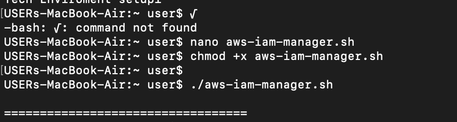
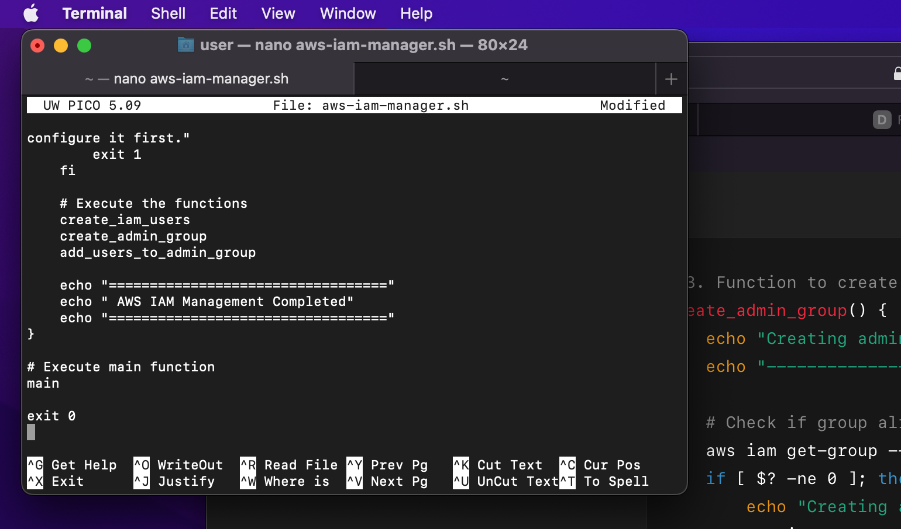
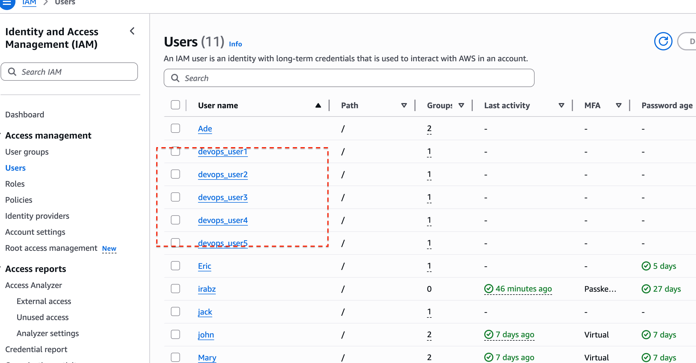

> # SHELL SCRIPT AWS

Objectives: 
Extend the provided script to include IAM management by: 
1. Defining IAM User Names Array to store the names of the five IAM users in an array for easy iteration during user creation. 
2. Create the IAM Users as you iterate through the array using AWS CLI commands. 
3. Define and call a function to create an IAM group named "admin" using the AWS CLI 
commands. 
4. Attach an AWS-managed administrative policy (e.g., "AdministratorAccess") to the "admin" group to grant administrative privileges. 
5. Iterate through the array of IAM user names and assign each user to the "admin" group using AWS CLI commands. 

These project is really trobuling cause it took me awhile to understand the concept of it and it a bit complex and this is what i could do 

1. Make sure AWS CLI is configured:

2. We have to save the in initail script in a desnigated flie also and run it and that we will need to run series of commands 

    " aws-iam-manager.sh"

    

    "chmod +x aws-iam-manager.sh"

    > 3. when we use the commands stated above i impliment the script in the crreated file and save it 

    
    
    

> 4. To be sure the desingated user are created, i logged into my AWS account to be sure 

5. > Then we run "./aws-iam-manager.sh"

     

